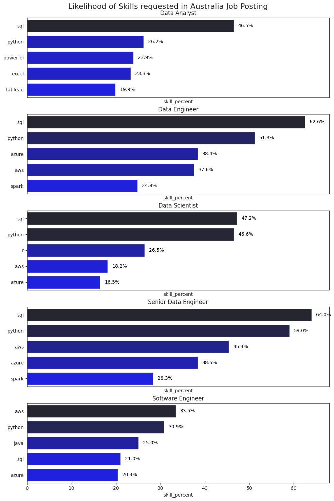
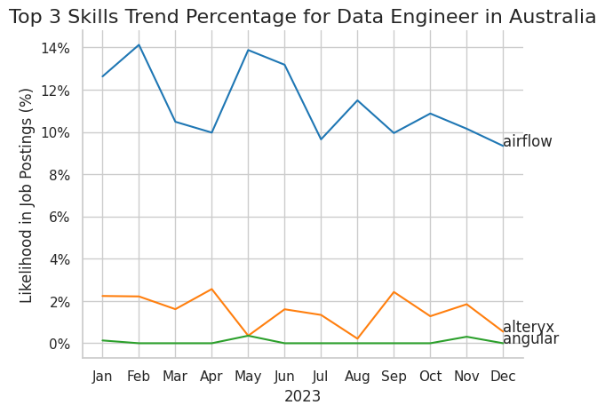
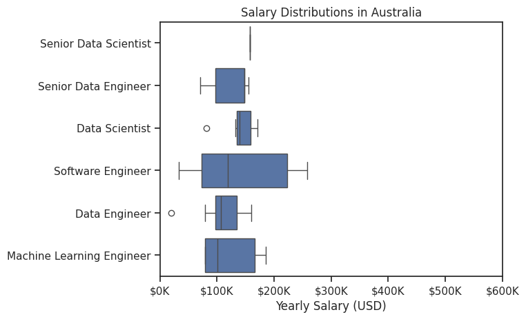
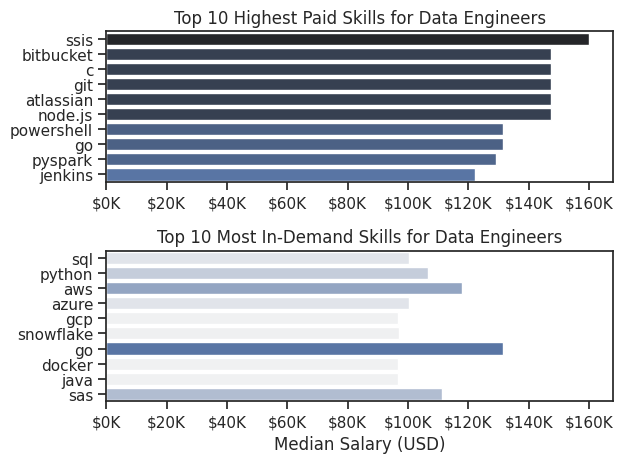

# Data_Project_On_Python
## 1_EDA_Intro.ipynb
Contains Explainatory Data Analysis intro.

## 2_Skill_Demand.ipynb
 # The Analysis
 ## What are the most demanded skills for the TOP 5 most popular data roles?

 To find the most demanded skills for top 5 most popular data roles. I filtered out these postitions by which ones were the most popular, and then got the top 5 skills for these top 5 roles. This query highlights the most popular job titles and their top skills , showing which skills I should pay attention to depending on the role I'm targeting.

 View my notebook with detailed steps here : 
 [2_Skill_Demand.ipynb](3_Project/2_Skill_Demand.ipynb)

 ### Visualise Data
 ```python
fig, ax =plt.subplots(len(job_titles),1, figsize=(10,15)) # Creating subplots for each job title        
sns.set_style('ticks')  # Setting seaborn style for better aesthetics

for i, job_title in enumerate( job_titles):
    df_plot = df_skills_percent[df_skills_percent['job_title_short']==job_title].head(5) # Getting top 5 skills for each job title
    #df_plot.plot(kind='barh',x='job_skills',y='skill_percent',ax=ax[i],title=job_title) # Plotting horizontal bar chart
    sns.barplot(data=df_plot, x='skill_percent', y='job_skills', ax=ax[i], hue='skill_count', palette='dark:b_r')  # Using seaborn for better aesthetics

    ax[i].set_title(job_title)  # Setting title for each subplot
    #ax[i].invert_yaxis()  # Inverting y-axis to have the highest count on top
    ax[i].set_ylabel('') # Removing y-axis label
    ax[i].legend().set_visible(False) # Hiding legend
    ax[i].set_xlim(0,68) # Setting x-axis limit for better visualization

    # Adding data labels to bars as Skill Percentage
    for n, v in enumerate(df_plot['skill_percent']):
        ax[i].text(v + 1, n, f"{v:.1f}%", color='black', va='center')  # Adding data labels to bars

    # Hiding x-axis ticks for all except the last subplot
    if i != len(job_titles) - 1:
        ax[i].set_xticks([]) # Hiding x-axis ticks

fig.suptitle('Likelihood of Skills requested in Australia Job Posting', fontsize=16) # Setting overall title
fig.tight_layout(h_pad=0.5) # Fix the overlapping issue
plt.show() 

```

### Results




### Insights
- SQL is the most versatile skill, highly demanded across all 5 top roles , most prominently for Data engineer (62.5%)
- Also, SQL is most requested skill for Senior data enginner
- Data engineer requires more specialised technical skills (AWS,azure,Spark) compared to data analyst.


## 3_Skill_Trend.ipynb
 # The Analysis
 ## How are in-demand skills trending for Data engineers?

 ### Visualise Data
 ```python
from matplotlib.ticker import PercentFormatter
ax = plt.gca()  # Getting current axis
ax.yaxis.set_major_formatter(PercentFormatter(decimals=0))  # Formatting y-axis to percentage

# Adding skill names at the end of each line for clarity
for i in range(3):
    plt.text(11,df_plot.iloc[-1,i],df_plot.columns[i]) #11 is the index for December, df_plot.iloc[-1,i] gets the last row value for each skill ,df_plot.columns[i] gets the skill name
plt.show()
 ```


*Bar graph visualising the trending top skills for data engineers in Australia in 2023*


### Insights : 
- Airflow remains the most in-demand skills throughout the year.
- alteryx is the second most in-demand skills and seem to have dipped down to its lowest (of around 1%) in the month of May and August.
-Angular is always the lowest throughout the year.


## 4_Salary_analysis.ipynb
 # The Analysis
 ## How well do jobs pay?

 ### Visualise Data
 ```python
sns.boxplot(data=df_AUS_top6, x='salary_year_avg', y='job_title_short',order=job_order)
sns.set_theme(style='ticks')

# this is all the same
plt.title('Salary Distributions in Australia')
plt.xlabel('Yearly Salary (USD)')
plt.ylabel('')
plt.xlim(0, 600000) 
ticks_x = plt.FuncFormatter(lambda y, pos: f'${int(y/1000)}K')
plt.gca().xaxis.set_major_formatter(ticks_x)
plt.show()
 ```
 
 *Box plot visualising the salary distributions for the TOP 6 data job titles.*

 ### Insights :
 - Software engineer has the most consistent salary ranging from ~100K to ~220K
 - Senior Data Engineer has boxed salary between ~100K to ~150K


# The Analysis
 ### What are the in-demand and highest paying skills for data engineers in Australia ?

### Visualise Data 
```python
fig, ax = plt.subplots(2, 1)  

sns.set_theme(style='ticks')

# Top 10 Highest Paid Skills for Data Engineers
sns.barplot(data=df_DE_top_pay, x='median', y=df_DE_top_pay.index, hue='median', ax=ax[0], palette='dark:b_r')
ax[0].legend().remove()
# original code:
# df_DE_top_pay[::-1].plot(kind='barh', y='median', ax=ax[0], legend=False) 
ax[0].set_title('Top 10 Highest Paid Skills for Data Engineers')
ax[0].set_ylabel('')
ax[0].set_xlabel('')
ax[0].xaxis.set_major_formatter(plt.FuncFormatter(lambda x, _: f'${int(x/1000)}K'))


# Top 10 Most In-Demand Skills for Data Engineers
sns.barplot(data=df_DE_skills, x='median', y=df_DE_skills.index, hue='median', ax=ax[1], palette='light:b')
ax[1].legend().remove()
# original code:
# df_DE_skills[::-1].plot(kind='barh', y='median', ax=ax[1], legend=False)
ax[1].set_title('Top 10 Most In-Demand Skills for Data Engineers')
ax[1].set_ylabel('')
ax[1].set_xlabel('Median Salary (USD)')
ax[1].set_xlim(ax[0].get_xlim())  # Set the same x-axis limits as the first plot
ax[1].xaxis.set_major_formatter(plt.FuncFormatter(lambda x, _: f'${int(x/1000)}K'))

plt.tight_layout()
plt.show()
```
 
 *Two seperate bar graphs visualising the highest paid skills and most in-demand skills for data engineers in Australia*

 ### Insights :
 - SSIS is the highest paid skill for data engineers in Australia with salary hitting ~160K
 - go is the most in-demand skills
 - bitbucket, c, git, atlassian and node.js are on the same category relating to highest paying skills for data engineers of around ~150K

